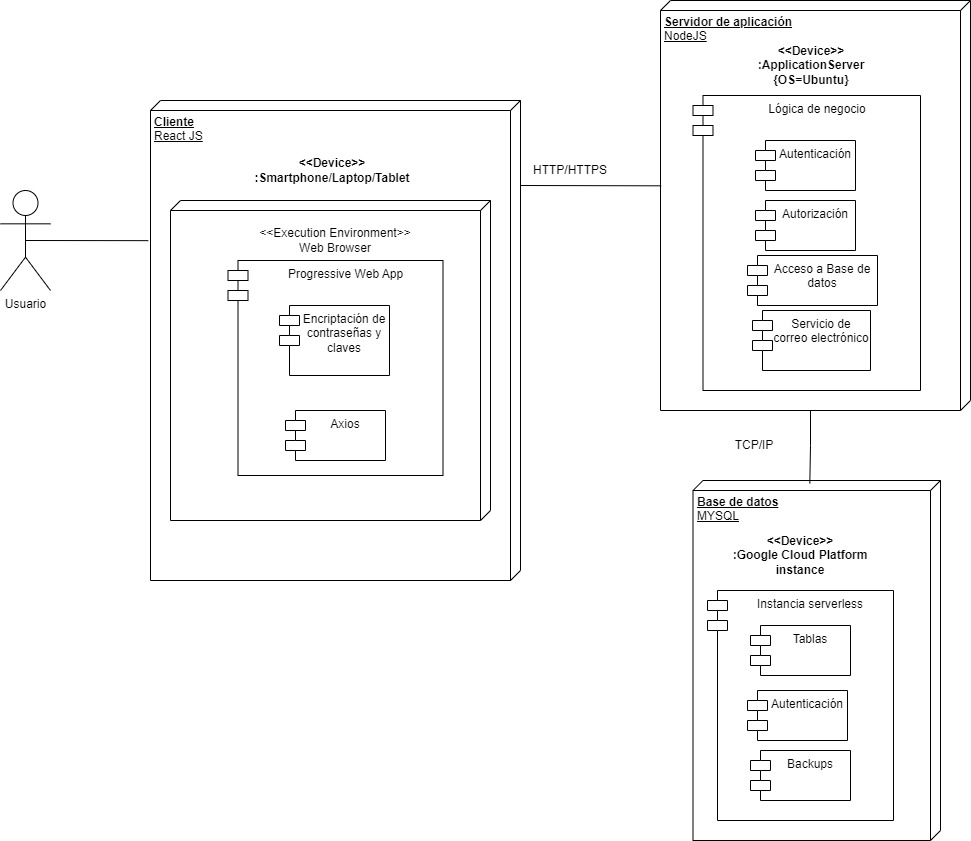
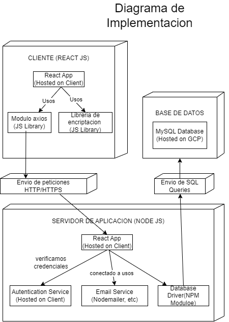

Universidad de San Carlos de Guatemala  
Facultad de Ingenieria  
Escuela de ciencias y sistemas  
Laboratorio de analisis y diseño 2  
  

|  Carnet | Nombre   |
| ------------ | ------------ |
| Luisa Maria Ortiz Romero  | 202003381   |
| Marjorie Gissell Reyes Franco | 202000560   |
| Luis Manuel Chay Marroquin  | 202000343  |
| Cristian Alessander Blanco Gonzalez  | 202000173  |
| Brayan Alexander Mejia Barrientos  |  201900576   |  

## Índice

1. [Antecedentes](#1-antecedentes)
2. [Core del Negocio](#2-core-del-negocio)
   - [Descripción](#a-descripción)
   - [Diagrama de CDU de Alto Nivel y su Primera Descomposición](#b-diagrama-de-cdu-de-alto-nivel-y-su-primera-descomposición)
3. [Lista de Requerimientos Funcionales Generales](#3-lista-de-requerimientos-funcionales-generales)
4. [Diagrama de CDU Expandidos](#4-diagrama-de-cdu-expandidos)
5. [Matrices de Trazabilidad](#5-matrices-de-trazabilidad)
   - [Stakeholders vs Requerimientos](#a-stakeholders-vs-requerimientos)
   - [Stakeholders vs CDU](#b-stakeholders-vs-cdu)
   - [Requerimiento vs CDU](#c-requerimiento-vs-cdu)
6. [Diagrama de Despliegue de la Arquitectura](#6-diagrama-de-despliegue-de-la-arquitectura)
7. [Selección del o los Estilos Arquitectónicos](#7-selección-del-o-los-estilos-arquitectónicos)
8. [Diagrama de Implementación (Despliegue y Componentes)](#8-diagrama-de-implementación-despliegue-y-componentes)
9. [Diagrama Entidad-Relación](#9-diagrama-entidad-relación)
10. [Prototipos de Interfaces](#10-prototipos-de-interfaces)
11. [Patrones de Diseño](#11-patrones-de-diseño)
12. [Tablero Kanban](#12-tablero-kanban)

## 1. Antecedentes

El proyecto de la aplicación QNave surge a partir de los desafíos que enfrentó una empresa de transporte privado en Guatemala, que inició sus operaciones en el año 2020. Inicialmente, la empresa operaba coordinando viajes mediante llamadas telefónicas entre los usuarios y los conductores. Sin embargo, este modelo operativo pronto encontró obstáculos significativos debido a la pandemia global y al creciente problema de inseguridad en el país.

Uno de los principales desafíos fue el aumento de la delincuencia organizada, que afectaba tanto a conductores como a usuarios. La situación se agravó hasta el punto en que los incidentes de robos, fraudes y amenazas se volvieron comunes, lo que generó una creciente sensación de inseguridad entre los conductores. Como resultado, muchos de ellos optaron por dejar la empresa en busca de empleos más seguros, y los usuarios comenzaron a migrar hacia competidores que ofrecían mayores garantías de seguridad.

Reconociendo la creciente insatisfacción y los riesgos a los que se enfrentaban tanto usuarios como empleados, el CEO de QNave decidió modernizar las operaciones de la empresa. El primer paso hacia este objetivo fue contratar a un programador freelance para desarrollar una solución tecnológica que mejorara la eficiencia y seguridad del servicio. Sin embargo, a pesar de los esfuerzos del programador, la solución propuesta carecía de claridad en su documentación, lo que dejó a la gerencia de la empresa con dudas sobre su viabilidad y escalabilidad a largo plazo.

Debido a estas preocupaciones, la gerencia de QNave decidió buscar una segunda opinión de un equipo profesional (incluyendo a ti y a tu grupo) para obtener una perspectiva más amplia y estratégica. El objetivo es abordar los desafíos actuales, optimizar los costos operativos y posicionar a QNave como líder en el mercado de transporte privado en Guatemala.

Este proyecto tiene como finalidad crear un marco de arquitectura de software robusto que asegure la adaptabilidad del sistema a futuros cambios, con un enfoque en mejorar la seguridad, escalabilidad y sostenibilidad financiera.

## 2. Core del Negocio

### a. Descripción

El **"Core del Negocio"** de Qnave se centra en proporcionar un servicio de transporte privado confiable y seguro en Guatemala. La aplicación busca resolver problemas operativos y de seguridad enfrentados por los usuarios y conductores mediante la modernización de sus operaciones. A continuación, se detalla la descripción del core del negocio:

- **Servicio Principal**:  
  La aplicación de transporte privado facilita la conexión entre usuarios que requieren un viaje y conductores que ofrecen servicios de transporte. Permite a los usuarios solicitar viajes, pagar por ellos, calificar a los conductores y reportar problemas.

- **Seguridad**:  
  La aplicación incluye mecanismos para verificar la identidad de los usuarios y conductores, asegurando la autenticidad de la información y proporcionando una plataforma segura para los pagos. Implementa un sistema de verificación por correo electrónico y encriptación de datos sensibles para proteger la información del usuario.

- **Administración**:  
  La plataforma también permite a los administradores gestionar los registros de usuarios y conductores, verificar documentos y supervisar el estado de la plataforma. Los asistentes y administradores tienen funciones específicas para mantener la operación de la empresa de manera eficiente y segura.

- **Operación**:  
  Los conductores pueden aceptar viajes, ver la información del usuario y recibir pagos. Los usuarios pueden solicitar viajes, seleccionar métodos de pago, calificar a los conductores y guardar ubicaciones frecuentes.

### Visión General de la Empresa

Qnave es una empresa de transporte privado en Guatemala que busca mejorar la seguridad y eficiencia en la coordinación de viajes entre usuarios y conductores mediante una solución tecnológica avanzada.

### Problemas Actuales

La empresa enfrenta problemas de seguridad debido a la delincuencia organizada que afecta tanto a usuarios como a conductores. Esto ha llevado a la pérdida de confianza y a una competencia desleal con otras empresas más seguras.

### Solución Propuesta

Modernizar las operaciones a través de una aplicación que mejore la seguridad y eficiencia, centralice la gestión de datos y ofrezca funcionalidades mejoradas para usuarios, conductores y administradores.

### Beneficios Esperados

- Reducción de incidentes de seguridad.
- Mejor experiencia para los usuarios.
- Mayor control sobre los conductores y asistentes.
- Un sistema de pago eficiente y seguro.

### b. Diagrama de CDU de Alto Nivel y su Primera Descomposición (CDU de Alto Nivel)

A continuación se muestra una imagen del diagrama de casos de uso de alto nivel y su descomposición:

Si no es posible la visualización correcta, puedes acceder al siguiente enlace:  
[Diagrama de casos de uso expandido (CDU)](https://drive.google.com/file/d/1C2ZjXQ7WkfcIYpbFYBW3_Md_Gb1_05qC/view?usp=sharing)

## Actores y Casos de Uso

### Usuarios

| Caso de Uso            | Descripción                                      | Relaciones                                                                                   |
|------------------------|--------------------------------------------------|----------------------------------------------------------------------------------------------|
| **Solicitar Viaje**     | El usuario inicia una solicitud de viaje.        | `<<include>>` con **Calcular Tarifa** `<<include>>` con **Enviar Solicitud a Conductores** |
| **Calificar Conductor** | El usuario califica al conductor después del viaje. | No tiene relaciones `<<include>>` o `<<extend>>`                                            |
| **Pagar Viaje**         | El usuario realiza el pago al finalizar el viaje. | `<<include>>` con **Confirmar Pago** `<<extend>>` con **Generar Recibo**                   |

### Conductores

| Caso de Uso            | Descripción                                        | Relaciones                                                                                   |
|------------------------|----------------------------------------------------|----------------------------------------------------------------------------------------------|
| **Aceptar Viaje**       | El conductor recibe y acepta una solicitud de viaje. | `<<include>>` con **Confirmar Viaje al Usuario**                                             |
| **Cancelar Viaje**      | El conductor cancela un viaje previamente aceptado. | `<<extend>>` con **Aceptar Viaje**                                                            |

### Asistentes

| Caso de Uso                | Descripción                                                | Relaciones                                                        |
|----------------------------|------------------------------------------------------------|-------------------------------------------------------------------|
| **Gestionar Registros**     | El asistente gestiona y actualiza los registros.           | `<<include>>` con **Revisar Documentos**                          |
| **Revisar Documentos**      | El asistente revisa los documentos de usuarios y conductores. | No tiene relaciones `<<include>>` o `<<extend>>`                  |
| **Asistir a Conductores y Usuarios** | El asistente proporciona ayuda a conductores y usuarios. | `<<include>>` con **Gestionar Registros**                         |

### Administrador

| Caso de Uso                 | Descripción                                                         | Relaciones                                                                                  |
|-----------------------------|---------------------------------------------------------------------|---------------------------------------------------------------------------------------------|
| **Manejar Problemas de Seguridad** | El administrador interviene en problemas de seguridad del sistema. | `<<include>>` con **Bloquear Usuario o Conductor** `<<extend>>` con **Generar Reporte de Incidente** |

## Descomposición de Casos de Uso

### Solicitar Viaje

| Secuencia                     | Descripción                                                                 | Relaciones                                    |
|-------------------------------|-----------------------------------------------------------------------------|-----------------------------------------------|
| **1. Usuario selecciona punto de partida y destino** | Primer paso del proceso de solicitar un viaje.                                     | No tiene relaciones `<<include>>` o `<<extend>>` |
| **2. Calcular Tarifa**         | El sistema calcula la tarifa del viaje basado en los puntos seleccionados.  | `<<include>>` con **Solicitar Viaje**         |
| **3. Enviar Solicitud a Conductores** | La solicitud se envía a los conductores disponibles.                             | `<<include>>` con **Solicitar Viaje**         |

### Aceptar Viaje

| Secuencia                     | Descripción                                                    | Relaciones                                    |
|-------------------------------|----------------------------------------------------------------|-----------------------------------------------|
| **1. Conductor recibe notificación** | El conductor recibe una notificación de una nueva solicitud de viaje.         | `<<include>>` con **Aceptar Viaje**           |
| **2. Conductor acepta o rechaza el viaje** | El conductor decide si acepta o rechaza la solicitud.                        | No tiene relaciones `<<include>>` o `<<extend>>` |
| **3. Confirmar Viaje al Usuario** | El sistema confirma al usuario que su viaje ha sido aceptado.                     | `<<include>>` con **Aceptar Viaje**           |

## Explicación de Relaciones `<<include>>` y `<<extend>>`

- **`<<include>>`**: Se usa cuando un caso de uso obliga a la ejecución de otro caso de uso. El comportamiento del caso de uso principal depende de la ejecución del caso incluido. Ejemplo: **Solicitar Viaje** incluye **Calcular Tarifa**.

- **`<<extend>>`**: Se usa cuando un caso de uso opcionalmente amplía el comportamiento de otro caso de uso. No es necesario para el funcionamiento principal, pero se agrega en ciertos contextos. Ejemplo: **Pagar Viaje** extiende **Generar Recibo**.

## 4. Diagrama de CDU expandidos
## Caso de Uso: Manejar Problemas de Seguridad

| **Campo**                   | **Descripción**                                                                 |
|-----------------------------|---------------------------------------------------------------------------------|
| **Nombre**                  | Manejar Problemas de Seguridad                                                    |
| **Actores**                 | Administrador                                                                    |
| **Propósito**               | Intervenir en problemas de seguridad del sistema.                                |
| **Tipo**                    | Principal                                                                        |
| **Descripción**             | El administrador maneja y resuelve problemas de seguridad que ocurren en el sistema. |
| **Curso Normal de Eventos** | 1. Identificar un problema de seguridad. 2. Evaluar el problema. 3. Intervenir y aplicar solución. 4. Notificar a los usuarios afectados si es necesario. |
| **Eventos Alternos**        | 1. Si el problema es crítico, generar un reporte de incidente. 2. Bloquear usuarios o conductores si es necesario. |

## Caso de Uso: Asistir a Conductores y Usuarios

| **Campo**                   | **Descripción**                                                                 |
|-----------------------------|---------------------------------------------------------------------------------|
| **Nombre**                  | Asistir a Conductores y Usuarios                                                 |
| **Actores**                 | Asistente                                                                       |
| **Propósito**               | Proporcionar ayuda a conductores y usuarios.                                      |
| **Tipo**                    | Principal                                                                        |
| **Descripción**             | El asistente brinda soporte y ayuda a conductores y usuarios en diversas situaciones. |
| **Curso Normal de Eventos** | 1. Recibir solicitud de asistencia. 2. Evaluar la solicitud. 3. Proporcionar la asistencia requerida. 4. Confirmar que el problema ha sido resuelto. |
| **Eventos Alternos**        | 1. Si el asistente no puede resolver el problema, escalar a un superior.          |

## Caso de Uso: Gestionar Registros

| **Campo**                   | **Descripción**                                                                 |
|-----------------------------|---------------------------------------------------------------------------------|
| **Nombre**                  | Gestionar Registros                                                               |
| **Actores**                 | Asistente                                                                       |
| **Propósito**               | Gestionar y actualizar los registros del sistema.                                |
| **Tipo**                    | Principal                                                                        |
| **Descripción**             | El asistente actualiza y gestiona la información de registros en el sistema.      |
| **Curso Normal de Eventos** | 1. Acceder a los registros. 2. Realizar actualizaciones necesarias. 3. Verificar que los cambios se han aplicado correctamente. 4. Documentar las modificaciones realizadas. |
| **Eventos Alternos**        | 1. Si hay errores en los registros, corregirlos antes de proceder.                |

## Caso de Uso: Revisar Documentos

| **Campo**                   | **Descripción**                                                                 |
|-----------------------------|---------------------------------------------------------------------------------|
| **Nombre**                  | Revisar Documentos                                                               |
| **Actores**                 | Asistente                                                                       |
| **Propósito**               | Revisar los documentos de usuarios y conductores.                                |
| **Tipo**                    | Principal                                                                        |
| **Descripción**             | El asistente verifica la validez y completitud de los documentos proporcionados. |
| **Curso Normal de Eventos** | 1. Recibir los documentos. 2. Revisar los documentos. 3. Validar la información. 4. Aprobar o solicitar correcciones. |
| **Eventos Alternos**        | 1. Solicitar documentos adicionales si los originales están incompletos.         |

## Caso de Uso: Aceptar Viaje

| **Campo**                   | **Descripción**                                                                 |
|-----------------------------|---------------------------------------------------------------------------------|
| **Nombre**                  | Aceptar Viaje                                                                     |
| **Actores**                 | Conductor                                                                        |
| **Propósito**               | Aceptar una solicitud de viaje recibida del sistema.                             |
| **Tipo**                    | Principal                                                                        |
| **Descripción**             | El conductor recibe y acepta una solicitud de viaje.                              |
| **Curso Normal de Eventos** | 1. Recibir notificación de la solicitud. 2. Revisar los detalles del viaje. 3. Aceptar o rechazar la solicitud. 4. Confirmar la aceptación al usuario. |
| **Eventos Alternos**        | 1. Cancelar el viaje si el conductor no puede aceptar la solicitud.              |

## Caso de Uso: Cancelar Viaje

| **Campo**                   | **Descripción**                                                                 |
|-----------------------------|---------------------------------------------------------------------------------|
| **Nombre**                  | Cancelar Viaje                                                                    |
| **Actores**                 | Conductor                                                                        |
| **Propósito**               | Cancelar un viaje previamente aceptado.                                           |
| **Tipo**                    | Alternativo                                                                       |
| **Descripción**             | El conductor cancela un viaje que había aceptado anteriormente.                   |
| **Curso Normal de Eventos** | 1. Seleccionar el viaje a cancelar. 2. Confirmar la cancelación. 3. Notificar al usuario. |
| **Eventos Alternos**        | 1. Si el viaje ya está en progreso, coordinar con el usuario para una solución alternativa. |

## Caso de Uso: Solicitar Viaje

| **Campo**                   | **Descripción**                                                                 |
|-----------------------------|---------------------------------------------------------------------------------|
| **Nombre**                  | Solicitar Viaje                                                                   |
| **Actores**                 | Usuario                                                                          |
| **Propósito**               | Iniciar una solicitud de viaje en el sistema.                                    |
| **Tipo**                    | Principal                                                                        |
| **Descripción**             | El usuario solicita un viaje especificando el punto de partida y destino.         |
| **Curso Normal de Eventos** | 1. Seleccionar punto de partida y destino. 2. Calcular tarifa. 3. Enviar solicitud a conductores. 4. Confirmar solicitud. |
| **Eventos Alternos**        | 1. Si no hay conductores disponibles, notificar al usuario y ofrecer alternativas. |

## Caso de Uso: Calificar Conductor

| **Campo**                   | **Descripción**                                                                 |
|-----------------------------|---------------------------------------------------------------------------------|
| **Nombre**                  | Calificar Conductor                                                               |
| **Actores**                 | Usuario                                                                          |
| **Propósito**               | Evaluar y calificar al conductor después de finalizar el viaje.                  |
| **Tipo**                    | Principal                                                                        |
| **Descripción**             | El usuario califica al conductor basado en su experiencia durante el viaje.      |
| **Curso Normal de Eventos** | 1. Completar el viaje. 2. Acceder a la opción de calificación. 3. Ingresar la calificación y comentarios. 4. Enviar la calificación. |
| **Eventos Alternos**        | 1. Si el usuario no califica inmediatamente, permitir la calificación en una fecha posterior. |

## Caso de Uso: Pagar Viaje

| **Campo**                   | **Descripción**                                                                 |
|-----------------------------|---------------------------------------------------------------------------------|
| **Nombre**                  | Pagar Viaje                                                                      |
| **Actores**                 | Usuario                                                                          |
| **Propósito**               | Realizar el pago del viaje una vez finalizado.                                   |
| **Tipo**                    | Principal                                                                        |
| **Descripción**             | El usuario realiza el pago por el viaje y el sistema confirma la transacción.    |
| **Curso Normal de Eventos** | 1. Finalizar el viaje. 2. Ingresar detalles de pago. 3. Confirmar el pago. 4. Generar recibo si es necesario. |
| **Eventos Alternos**        | 1. Si hay un problema con el pago, ofrecer opciones de resolución o reintento.   |

## 5. Matrices de Trazabilidad

### a. Matriz de Stakeholders vs Requerimientos

Esta matriz vincula cada stakeholder con los requerimientos del sistema para asegurar que las necesidades de todos los actores están cubiertas.
## a. Matriz de Stakeholders vs Requerimientos

| Stakeholder    | Registro de Usuario | Registro de Conductor | Registro de Asistente | Autenticación y Seguridad | Gestión de Viajes | Gestión de Información Personal | Interacción y Calificación | Gestión de Pagos | Reportes y Estadísticas |
|----------------|----------------------|------------------------|------------------------|---------------------------|-------------------|-------------------------------|----------------------------|------------------|--------------------------|
| Usuario        | X                    |                        |                        | X                         | X                 | X                             | X                          | X                |                          |
| Conductor      |                      | X                      |                        | X                         | X                 | X                             | X                          | X                |                          |
| Asistente      |                      |                        | X                      | X                         |                   | X                             |                            |                  |                          |
| Administrador  |                      |                        |                        | X                         |                   |                               |                            |                  | X                        |

### b. Matriz de Stakeholders vs CDU

Esta matriz vincula cada stakeholder con los casos de uso del sistema para asegurarse de que cada actor interactúe con las funcionalidades necesarias.

| **Stakeholder** | **Solicitar Viaje** | **Pagar Viaje** | **Calificar Conductor** | **Aceptar Viaje** | **Cancelar Viaje** | **Gestionar Registros** | **Revisar Documentos** | **Asistir a Conductores y Usuarios** | **Manejar Problemas de Seguridad** |
|-----------------|----------------------|------------------|--------------------------|-------------------|---------------------|-------------------------|-------------------------|-------------------------------------|-----------------------------------|
| Usuario         | X                    | X                | X                        |                   |                     |                         |                         |                                     |                                   |
| Conductor       |                      |                  |                          | X                 | X                   |                         |                         |                                     |                                   |
| Asistente       |                      |                  |                          |                   |                     | X                       | X                       | X                                   |                                   |
| Administrador    |                      |                  |                          |                   |                     |                         |                         |                                     | X                                 |

### c. Matriz de Requerimiento vs CDU

Esta matriz muestra qué casos de uso cubren cada requerimiento del sistema, asegurando que cada requerimiento esté asociado con los casos de uso correspondientes.

| Requerimiento                    | Solicitar Viaje | Pagar Viaje | Calificar Conductor | Aceptar Viaje | Cancelar Viaje | Gestionar Registros | Revisar Documentos | Asistir a Conductores y Usuarios | Manejar Problemas de Seguridad |
|----------------------------------|-----------------|-------------|----------------------|---------------|----------------|----------------------|--------------------|----------------------------------|------------------------------|
| Registro de Usuario              |                 |             |                      |               |                |                      |                    |                                  |                              |
| Registro de Conductor            |                 |             |                      |               |                |                      |                    |                                  |                              |
| Registro de Asistente            |                 |             |                      |               |                |                      |                    |                                  |                              |
| Autenticación y Seguridad        |                 |             |                      |               |                |                      |                    |                                  | X                            |
| Gestión de Viajes                | X               | X           | X                    | X             | X              |                      |                    |                                  |                              |
| Gestión de Información Personal  |                 |             |                      |               |                | X                    |                    |                                  |                              |
| Interacción y Calificación       |                 |             | X                    |               |                |                      |                    |                                  |                              |
| Gestión de Pagos                 |                 | X           |                      |               |                |                      |                    |                                  |                              |
| Reportes y Estadísticas          |                 |             |                      |               |                |                      |                    |                                  | X                            |

## 7. Selección del o los Estilos Arquitectónicos

Se eligió la arquitectura de tres niveles para el proyecto por las siguientes razones:

1. **Separación de Responsabilidades**: La arquitectura de tres niveles divide la aplicación en tres capas distintas: la capa de presentación (cliente), la capa de lógica de negocio (servidor de aplicaciones), y la capa de datos (base de datos). Esta separación permite que cada capa se enfoque en su propia función, lo que facilita el mantenimiento y la escalabilidad del sistema. Por ejemplo, el cliente maneja la interfaz de usuario y la interacción, mientras que el servidor de aplicaciones gestiona la lógica del negocio y la base de datos se encarga del almacenamiento y recuperación de datos.

2. **Escalabilidad**: Al separar la lógica de negocio y la base de datos del cliente, es más fácil escalar cada capa de manera independiente. Si se necesita manejar más solicitudes, se puede escalar horizontalmente el servidor de aplicaciones sin necesidad de modificar el cliente o la base de datos. 

3. **Mantenimiento y Flexibilidad**: Al tener capas separadas, es más sencillo actualizar o modificar una capa sin afectar las otras. Por ejemplo, si se decide cambiar la tecnología de la base de datos o se necesita agregar una nueva funcionalidad al servidor de aplicaciones, se pueden hacer estos cambios sin afectar directamente al cliente. 

4. **Seguridad**: En esta arquitectura, los datos sensibles y la lógica de negocio se manejan en el servidor, no en el cliente. Esto reduce el riesgo de que usuarios malintencionados accedan a partes críticas del sistema.

5. **Modularidad**: La modularidad de esta arquitectura permite a los desarrolladores trabajar de manera independiente en diferentes capas. Por ejemplo, un equipo puede estar desarrollando la interfaz de usuario mientras otro se enfoca en la lógica de negocio.

6. **Mejora en el Rendimiento**: Al gestionar las tareas intensivas en el servidor de aplicaciones, como el acceso a la base de datos o el envío de correos electrónicos, el cliente puede mantenerse ligero y responder rápidamente a las acciones del usuario. 

## 8. Diagrama de Despliegue de la Arquitectura

### Diagrama de despliegue y componentes

### Diagrama de de implementacion

La arquitectura compuesta por React, Node.js, Axios y MySQL se ha convertido en un estándar de la industria para el desarrollo de aplicaciones web modernas. Esta combinación ofrece una serie de ventajas que la convierten en una opción ideal para una amplia gama de proyectos.

## ¿Por qué elegir esta combinación?

### Desarrollo ágil y eficiente:
- *React*: Su enfoque basado en componentes y su declaración JSX facilitan la creación de interfaces de usuario complejas de manera rápida y eficiente.
- *Node.js*: Al compartir el mismo lenguaje (JavaScript) tanto en el frontend como en el backend, se reduce la curva de aprendizaje y se agiliza el desarrollo.
- *Axios*: Simplifica las llamadas HTTP entre el frontend y el backend, reduciendo la cantidad de código a escribir.

### Aplicaciones de alto rendimiento:
- *React*: El renderizado virtual y la optimización de la DOM contribuyen a una experiencia de usuario fluida y rápida.
- *Node.js*: Su modelo de E/S no bloqueante permite manejar múltiples solicitudes de manera eficiente, lo que resulta en un mejor rendimiento.
- *Axios*: Ofrece características avanzadas para la optimización de solicitudes, como la interceptación de solicitudes y respuestas.

### Arquitectura modular y escalable:
- *React*: La estructura basada en componentes promueve la modularidad y la reutilización del código.
- *Node.js*: Es altamente escalable y puede manejar grandes cargas de trabajo gracias a su modelo de eventos.
- *MySQL*: Ofrece una alta disponibilidad y escalabilidad, lo que permite manejar grandes volúmenes de datos.

### Experiencia de usuario excepcional:
- *React*: Crea interfaces de usuario intuitivas y responsivas que se adaptan a diferentes dispositivos.
- *Node.js*: Permite construir API RESTful eficientes que alimentan las interfaces de usuario de React.

### Amplio ecosistema:
- *React, Node.js y Axios*: Cuentan con una gran comunidad de desarrolladores, lo que significa una amplia variedad de bibliotecas, herramientas y recursos disponibles.

## Beneficios concretos:
- *Mayor productividad*: Reducción del tiempo de desarrollo gracias a la reutilización de código y herramientas integradas.
- *Aplicaciones más robustas*: Menor cantidad de errores y mayor estabilidad debido a la madurez de estos frameworks y a la amplia comunidad que los respalda.
- *Facilidad de mantenimiento*: Código más fácil de entender y modificar, lo que facilita el mantenimiento a largo plazo.
- *Adaptabilidad a las nuevas tecnologías*: Aprovecha las últimas tendencias y tecnologías, ya que estos frameworks están en constante evolución.

## ¿Por qué elegir esta combinación en lugar de otras?

- *JavaScript unificado*: Al utilizar JavaScript tanto en el frontend como en el backend, se simplifica el desarrollo y se reduce la curva de aprendizaje.
- *Rendimiento excepcional*: La combinación de React, Node.js y Axios ofrece un rendimiento superior en comparación con otras tecnologías.
- *Gran comunidad y ecosistema*: La amplia comunidad de desarrolladores garantiza un soporte constante y una gran cantidad de recursos disponibles.
- *Escalabilidad*: Esta arquitectura se adapta fácilmente a proyectos de cualquier tamaño, desde pequeñas aplicaciones hasta grandes plataformas.

En resumen, la combinación de React, Node.js, Axios y MySQL ofrece una solución completa y robusta para el desarrollo de aplicaciones web modernas. Al elegir esta tecnología, estarás invirtiendo en un futuro a prueba del tiempo y en la creación de aplicaciones de alta calidad que satisfacen las necesidades de los usuarios.