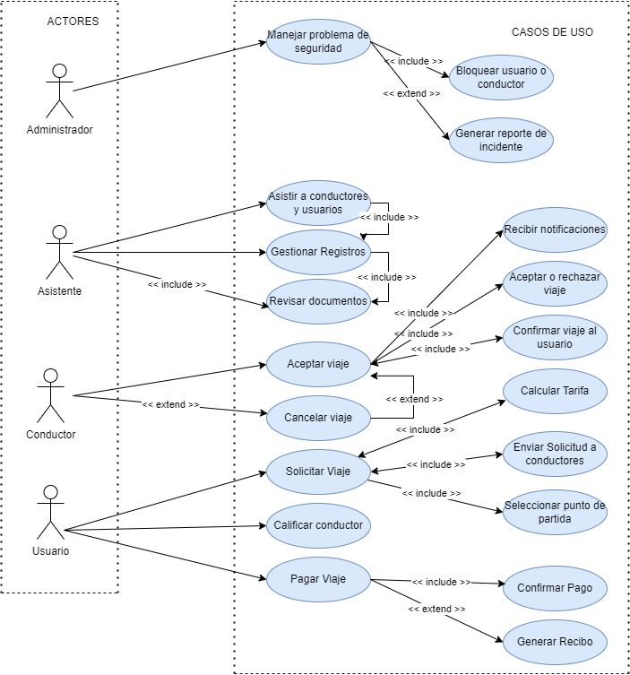

Universidad de San Carlos de Guatemala  
Facultad de Ingenieria  
Escuela de ciencias y sistemas  
Laboratorio de analisis y diseño 2  
  

|  Carnet | Nombre   |
| ------------ | ------------ |
| Luisa Maria Ortiz Romero  | 202003381   |
| Marjorie Gissell Reyes Franco | 202000560   |
| Luis Manuel Chay Marroquin  | 202000343  |
| Cristian Alessander Blanco Gonzalez  | 202000173  |
| Brayan Alexander Mejia Barrientos  |  201900576   |  
## 2. Core del Negocio

### a. Descripción

El **"Core del Negocio"** de Qnave se centra en proporcionar un servicio de transporte privado confiable y seguro en Guatemala. La aplicación busca resolver problemas operativos y de seguridad enfrentados por los usuarios y conductores mediante la modernización de sus operaciones. A continuación, se detalla la descripción del core del negocio:

- **Servicio Principal**:  
  La aplicación de transporte privado facilita la conexión entre usuarios que requieren un viaje y conductores que ofrecen servicios de transporte. Permite a los usuarios solicitar viajes, pagar por ellos, calificar a los conductores y reportar problemas.

- **Seguridad**:  
  La aplicación incluye mecanismos para verificar la identidad de los usuarios y conductores, asegurando la autenticidad de la información y proporcionando una plataforma segura para los pagos. Implementa un sistema de verificación por correo electrónico y encriptación de datos sensibles para proteger la información del usuario.

- **Administración**:  
  La plataforma también permite a los administradores gestionar los registros de usuarios y conductores, verificar documentos y supervisar el estado de la plataforma. Los asistentes y administradores tienen funciones específicas para mantener la operación de la empresa de manera eficiente y segura.

- **Operación**:  
  Los conductores pueden aceptar viajes, ver la información del usuario y recibir pagos. Los usuarios pueden solicitar viajes, seleccionar métodos de pago, calificar a los conductores y guardar ubicaciones frecuentes.

### Visión General de la Empresa

Qnave es una empresa de transporte privado en Guatemala que busca mejorar la seguridad y eficiencia en la coordinación de viajes entre usuarios y conductores mediante una solución tecnológica avanzada.

### Problemas Actuales

La empresa enfrenta problemas de seguridad debido a la delincuencia organizada que afecta tanto a usuarios como a conductores. Esto ha llevado a la pérdida de confianza y a una competencia desleal con otras empresas más seguras.

### Solución Propuesta

Modernizar las operaciones a través de una aplicación que mejore la seguridad y eficiencia, centralice la gestión de datos y ofrezca funcionalidades mejoradas para usuarios, conductores y administradores.

### Beneficios Esperados

- Reducción de incidentes de seguridad.
- Mejor experiencia para los usuarios.
- Mayor control sobre los conductores y asistentes.
- Un sistema de pago eficiente y seguro.

### b. Diagrama de CDU de Alto Nivel y su Primera Descomposición (CDU de Alto Nivel)

A continuación se muestra una imagen del diagrama de casos de uso de alto nivel y su descomposición:

Si no es posible la visualización correcta, puedes acceder al siguiente enlace:  
[Diagrama de casos de uso expandido (CDU)](https://drive.google.com/file/d/1C2ZjXQ7WkfcIYpbFYBW3_Md_Gb1_05qC/view?usp=sharing)

## Actores y Casos de Uso

### Usuarios

| Caso de Uso            | Descripción                                      | Relaciones                                                                                   |
|------------------------|--------------------------------------------------|----------------------------------------------------------------------------------------------|
| **Solicitar Viaje**     | El usuario inicia una solicitud de viaje.        | `<<include>>` con **Calcular Tarifa** `<<include>>` con **Enviar Solicitud a Conductores** |
| **Calificar Conductor** | El usuario califica al conductor después del viaje. | No tiene relaciones `<<include>>` o `<<extend>>`                                            |
| **Pagar Viaje**         | El usuario realiza el pago al finalizar el viaje. | `<<include>>` con **Confirmar Pago** `<<extend>>` con **Generar Recibo**                   |

### Conductores

| Caso de Uso            | Descripción                                        | Relaciones                                                                                   |
|------------------------|----------------------------------------------------|----------------------------------------------------------------------------------------------|
| **Aceptar Viaje**       | El conductor recibe y acepta una solicitud de viaje. | `<<include>>` con **Confirmar Viaje al Usuario**                                             |
| **Cancelar Viaje**      | El conductor cancela un viaje previamente aceptado. | `<<extend>>` con **Aceptar Viaje**                                                            |

### Asistentes

| Caso de Uso                | Descripción                                                | Relaciones                                                        |
|----------------------------|------------------------------------------------------------|-------------------------------------------------------------------|
| **Gestionar Registros**     | El asistente gestiona y actualiza los registros.           | `<<include>>` con **Revisar Documentos**                          |
| **Revisar Documentos**      | El asistente revisa los documentos de usuarios y conductores. | No tiene relaciones `<<include>>` o `<<extend>>`                  |
| **Asistir a Conductores y Usuarios** | El asistente proporciona ayuda a conductores y usuarios. | `<<include>>` con **Gestionar Registros**                         |

### Administrador

| Caso de Uso                 | Descripción                                                         | Relaciones                                                                                  |
|-----------------------------|---------------------------------------------------------------------|---------------------------------------------------------------------------------------------|
| **Manejar Problemas de Seguridad** | El administrador interviene en problemas de seguridad del sistema. | `<<include>>` con **Bloquear Usuario o Conductor** `<<extend>>` con **Generar Reporte de Incidente** |

## Descomposición de Casos de Uso

### Solicitar Viaje

| Secuencia                     | Descripción                                                                 | Relaciones                                    |
|-------------------------------|-----------------------------------------------------------------------------|-----------------------------------------------|
| **1. Usuario selecciona punto de partida y destino** | Primer paso del proceso de solicitar un viaje.                                     | No tiene relaciones `<<include>>` o `<<extend>>` |
| **2. Calcular Tarifa**         | El sistema calcula la tarifa del viaje basado en los puntos seleccionados.  | `<<include>>` con **Solicitar Viaje**         |
| **3. Enviar Solicitud a Conductores** | La solicitud se envía a los conductores disponibles.                             | `<<include>>` con **Solicitar Viaje**         |

### Aceptar Viaje

| Secuencia                     | Descripción                                                    | Relaciones                                    |
|-------------------------------|----------------------------------------------------------------|-----------------------------------------------|
| **1. Conductor recibe notificación** | El conductor recibe una notificación de una nueva solicitud de viaje.         | `<<include>>` con **Aceptar Viaje**           |
| **2. Conductor acepta o rechaza el viaje** | El conductor decide si acepta o rechaza la solicitud.                        | No tiene relaciones `<<include>>` o `<<extend>>` |
| **3. Confirmar Viaje al Usuario** | El sistema confirma al usuario que su viaje ha sido aceptado.                     | `<<include>>` con **Aceptar Viaje**           |

## Explicación de Relaciones `<<include>>` y `<<extend>>`

- **`<<include>>`**: Se usa cuando un caso de uso obliga a la ejecución de otro caso de uso. El comportamiento del caso de uso principal depende de la ejecución del caso incluido. Ejemplo: **Solicitar Viaje** incluye **Calcular Tarifa**.

- **`<<extend>>`**: Se usa cuando un caso de uso opcionalmente amplía el comportamiento de otro caso de uso. No es necesario para el funcionamiento principal, pero se agrega en ciertos contextos. Ejemplo: **Pagar Viaje** extiende **Generar Recibo**.

## 5. Matrices de Trazabilidad

### a. Matriz de Stakeholders vs Requerimientos

Esta matriz vincula cada stakeholder con los requerimientos del sistema para asegurar que las necesidades de todos los actores están cubiertas.

| **Stakeholder** | **Solicitar Viaje** | **Pagar Viaje** | **Calificar Conductor** | **Aceptar Viaje** | **Cancelar Viaje** | **Gestionar Registros** | **Revisar Documentos** | **Asistir a Conductores y Usuarios** | **Manejar Problemas de Seguridad** |
|-----------------|----------------------|------------------|--------------------------|-------------------|---------------------|-------------------------|-------------------------|-------------------------------------|-----------------------------------|
| Usuario         | X                    | X                | X                        |                   |                     |                         |                         |                                     |                                   |
| Conductor       |                      |                  |                          | X                 | X                   |                         |                         |                                     |                                   |
| Asistente       |                      |                  |                          |                   |                     | X                       | X                       | X                                   |                                   |
| Administrador    |                      |                  |                          |                   |                     |                         |                         |                                     | X                                 |

### b. Matriz de Stakeholders vs CDU

Esta matriz vincula cada stakeholder con los casos de uso del sistema para asegurarse de que cada actor interactúe con las funcionalidades necesarias.

| **Stakeholder** | **Solicitar Viaje** | **Pagar Viaje** | **Calificar Conductor** | **Aceptar Viaje** | **Cancelar Viaje** | **Gestionar Registros** | **Revisar Documentos** | **Asistir a Conductores y Usuarios** | **Manejar Problemas de Seguridad** |
|-----------------|----------------------|------------------|--------------------------|-------------------|---------------------|-------------------------|-------------------------|-------------------------------------|-----------------------------------|
| Usuario         | X                    | X                | X                        |                   |                     |                         |                         |                                     |                                   |
| Conductor       |                      |                  |                          | X                 | X                   |                         |                         |                                     |                                   |
| Asistente       |                      |                  |                          |                   |                     | X                       | X                       | X                                   |                                   |
| Administrador    |                      |                  |                          |                   |                     |                         |                         |                                     | X                                 |

### c. Matriz de Requerimiento vs CDU

Esta matriz muestra qué casos de uso cubren cada requerimiento del sistema, asegurando que cada requerimiento esté asociado con los casos de uso correspondientes.

| **Requerimiento**       | **Solicitar Viaje** | **Pagar Viaje** | **Calificar Conductor** | **Aceptar Viaje** | **Cancelar Viaje** | **Gestionar Registros** | **Revisar Documentos** | **Asistir a Conductores y Usuarios** | **Manejar Problemas de Seguridad** |
|-------------------------|----------------------|------------------|--------------------------|-------------------|---------------------|-------------------------|-------------------------|-------------------------------------|-----------------------------------|
| Solicitar Viaje         | X                    |                  |                          |                   |                     |                         |                         |                                     |                                   |
| Pagar Viaje             |                      | X                |                          |                   |                     |                         |                         |                                     |                                   |
| Calificar Conductor     |                      |                  | X                        |                   |                     |                         |                         |                                     |                                   |
| Aceptar Viaje           |                      |                  |                          | X                 |                     |                         |                         |                                     |                                   |
| Cancelar Viaje          |                      |                  |                          | X                 | X                   |                         |                         |                                     |                                   |
| Gestionar Registros     |                      |                  |                          |                   |                     | X                       | X                       | X                                   |                                   |
| Revisar Documentos      |                      |                  |                          |                   |                     | X                       | X                       |                                     |                                   |
| Asistir a Conductores y Usuarios |                  |                  |                          |                   |                     | X                       |                         | X                                   |                                   |
| Manejar Problemas de Seguridad |                  |                  |                          |                   |                     |                         |                         |                                     | X                                 |

## 8. Diagrama de Despliegue de la Arquitectura

Este diagrama ilustra la distribución física de los componentes del sistema en la infraestructura de hardware. En el caso de Qnave, se podría representar así:

### Componentes Principales:

- **Servidor de Aplicación:** Hospeda la aplicación web y la lógica de negocio.
- **Servidor de Base de Datos:** Almacena toda la información de usuarios, conductores, viajes, etc.
- **Servidor de Correo Electrónico:** Envía notificaciones y confirmaciones por correo.
- **Dispositivos de Usuario:** Smartphones, tablets y computadoras que los usuarios y conductores utilizan para interactuar con la aplicación.

### Conexiones:

- **Aplicación Web <-> Servidor de Base de Datos:** Comunicación para consultas y actualizaciones de datos.
- **Aplicación Web <-> Servidor de Correo Electrónico:** Envío de notificaciones y confirmaciones.
- **Usuarios/Conductores <-> Aplicación Web:** Interacción a través de interfaces de usuario.

Este diagrama ayuda a visualizar cómo se distribuyen los componentes del sistema y cómo se comunican entre sí, asegurando una correcta implementación y operación del sistema.

